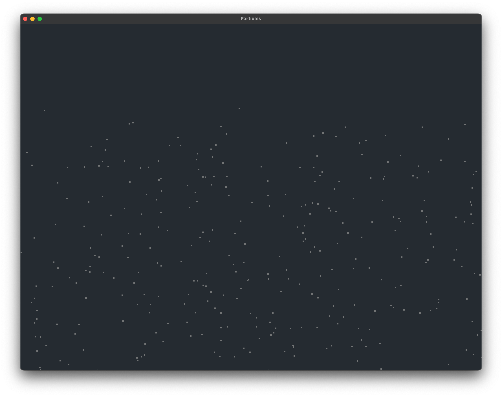

# Memory Allocator inspector

This little program inspects how much time the memory allocator takes to allocate memory on the head.

Run the program in quiet mode with:

```shell
cargo run -q 2> alloc.tsv
```

You should see a window with a bunch of particles like this:



The program will panic after a few seconds, but you will be able to see the memory allocator timings in the `alloc.tsv` file.
